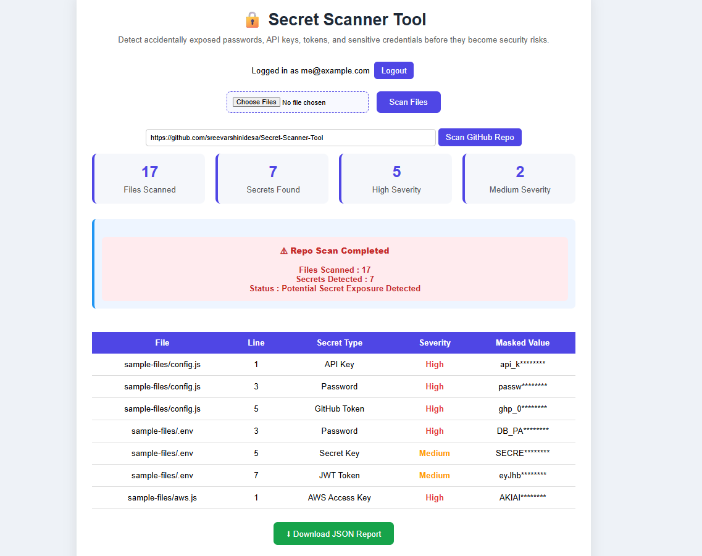
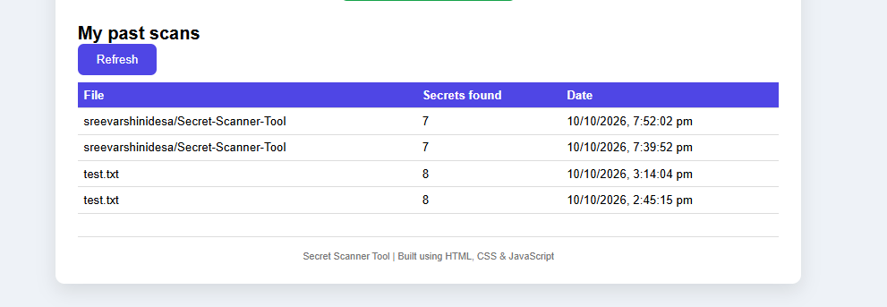

<!-- README START -->
# 🔒 Secret Scanner Tool

A full-stack security tool that detects accidentally exposed passwords, API keys, tokens, and other credentials in uploaded files and public GitHub repositories, before they become security risks.

> ⚠️ The `sample-files/` folder contains **fake** credentials for testing and demos only.

## Screenshots

### Repo scan results


### Scan history


## Features

- **File scanning:** upload one or more files and scan them for exposed secrets
- **GitHub repo scanning:** paste a public repo link and scan its files (up to 100 text files per scan)
- **14 detection patterns:** passwords, API keys, GitHub tokens, AWS access keys, Google API keys, JWTs, Bearer tokens, OpenAI keys, Stripe keys, private keys, Slack tokens, SendGrid keys, database URLs with passwords, and generic secret keys
- **Entropy analysis:** flags long random-looking strings that no known pattern matches
- **False-positive reduction:**
  - skips safe code such as `process.env.X` and placeholder values
  - file-type-aware rules: in code files a password must be a quoted string, so variables like `password: hashed` are ignored
  - ignores URLs in the entropy check
  - skips lockfiles, binaries, and `node_modules` in repo scans
- **Masked output:** secrets are masked on the server, so the real value never reaches the browser
- **Severity levels:** High and Medium, with summary cards and a results table
- **JSON report:** download the findings as a file
- **User accounts:** sign up and log in with hashed passwords and JWT authentication
- **Scan history:** each logged-in user can see their own past scans, and no one else's

## Tech Stack

| Layer | Technology |
|---|---|
| Frontend | HTML, CSS, JavaScript (Fetch API, localStorage) |
| Backend | Node.js, Express |
| Database | MongoDB Atlas with Mongoose |
| Auth | bcryptjs (password hashing), JSON Web Tokens |
| External API | GitHub REST API |

## How It Works

1. The browser reads the selected file (or takes the GitHub repo link) and sends it to the Express API.
2. For a repo, the server asks GitHub for the default branch and file list, skips files that shouldn't be scanned, and downloads the rest in batches of 10.
3. The scanner runs each line against regex patterns, applies the false-positive rules, and runs an entropy check on lines with no match.
4. Findings are masked on the server and returned as JSON.
5. If the user is logged in (valid JWT), the scan is saved to MongoDB and appears in "My past scans".
6. The frontend renders the results, building table rows with `textContent` so file names from other people's repos can't inject HTML.

## API Endpoints

| Method | Route | Auth | Description |
|---|---|---|---|
| POST | `/register` | none | Create an account |
| POST | `/login` | none | Log in and receive a JWT |
| POST | `/scan` | optional | Scan text from an uploaded file; saved if logged in |
| POST | `/scan-repo` | optional | Scan a public GitHub repo; saved if logged in |
| GET | `/scans` | required | List the logged-in user's past scans |

## Project Structure

```
Secret-Scanner-Tool/
├── index.html
├── script.js
├── style.css
├── sample-files/        # fake credentials for demos
└── backend/
    ├── server.js
    ├── scanner.js       # patterns, entropy, false-positive rules
    ├── githubScanner.js # GitHub repo scanning
    ├── middleware/auth.js
    └── models/          # User.js, Scan.js
```

## Run Locally

**Requirements:** Node.js 18 or newer, and a free MongoDB Atlas cluster.

```bash
git clone https://github.com/sreevarshinidesa/Secret-Scanner-Tool.git
cd Secret-Scanner-Tool/backend
npm install
```

Create `backend/.env`:

```
MONGO_URI=your_mongodb_connection_string
JWT_SECRET=any_long_random_text
```

Start the server and open the page:

```bash
node server.js
```

Then open `index.html` in your browser. The server runs on `http://localhost:5000`.

## Security Notes

- Passwords are hashed with bcrypt, never stored in plain text
- Login errors don't reveal whether an email exists
- `.env` is git-ignored and never committed
- Detected secrets are masked before being sent to the browser

## Limitations

- Only **public** GitHub repos are supported
- Repo scans cover the default branch and the first 100 text files, with a 200 KB limit per file
- Git history is not scanned, only the current files
- Unauthenticated GitHub API access is limited to about 60 requests per hour
- Detection is regex and entropy based, so some false positives and false negatives are possible
- Not deployed yet: the page expects the API at `localhost:5000`

## What I Learned

- Connecting a frontend, a REST API, a database, and an external API into one working application
- Debugging a DNS (`querySrv ECONNREFUSED`) problem with MongoDB Atlas SRV connection strings
- A Mongoose gotcha: a field named `type` must be written as `type: { type: String }`
- Reducing false positives: my scanner flagged its own code, which led to file-type-aware rules
- Why user-controlled strings (like file names from other repos) should never be inserted as HTML

## Future Improvements

- Deploy with a live demo link
- Support private repos and a GitHub token for higher rate limits
- Scan git commit history
- Severity chart on the dashboard
- Custom rules per user

## Author

Sreevarshini Desa · [GitHub](https://github.com/sreevarshinidesa)
<!-- README END -->